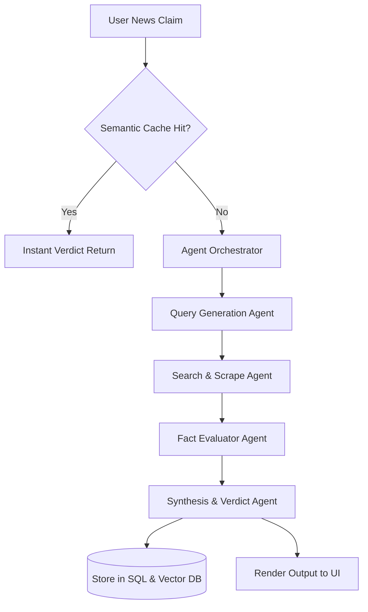

# 🚀 Veritas AI: Production Readiness Roadmap

This document outlines the features, architecture, and upgrades needed to scale **Veritas AI** from its current prototype state into a secure, scalable, and high-performance production web application.

---

## 📋 Table of Contents
- [1. Core Architecture Upgrades](#1-core-architecture-upgrades)
- [2. Advanced LLM & Agentic Verification Architecture](#2-advanced-llm--agentic-verification-architecture)
- [3. Frontend & UX Production Enhancements](#3-frontend--ux-production-enhancements)
- [4. Security, Scaling & Rate Limiting](#4-security-scaling--rate-limiting)
- [5. Monitoring, Observability & LLM Ops](#5-monitoring-observability--llm-ops)
- [6. Strategic Implementation Plan](#6-strategic-implementation-plan)

---

## 1. Core Architecture Upgrades

Currently, the application processes claims in-memory and executes live web searches for every single request. A production application requires persistence, optimization, and state management.

### A. Database Integration (SQL/NoSQL)
*   **User Accounts & Authentication**: Integrate Firebase Authentication or Auth0 so users can sign in, save verified claims, configure notifications, and manage custom settings.
*   **Persistent Verification Logs**: Store every verification report (JSON response, inputs, metadata) in a persistent database like **PostgreSQL** or **Cloud Firestore**.
*   **Shareable Reports**: Enable unique, slug-based public URLs (e.g., `veritas.ai/report/e4a1-b8d9`) so users can share factual reports on social media.

### B. Semantic Caching & Vector DB
*   **The Problem**: Running live search and LLM synthesis on every claim verification request takes 5–8 seconds and costs API credits. Many users search for the exact same viral rumors.
*   **The Solution**:
    1. Generate high-quality embeddings for every new claim verified (using `text-embedding-004`).
    2. Save the claim text, embedding, and verdict JSON in a Vector Database (e.g., **Pinecone**, **Milvus**, or **PGVector**).
    3. When a user submits a claim, generate its embedding and query the Vector DB first.
    4. If there is a match with a high similarity score (e.g., > 0.92 cosine similarity) and the cached verdict is fresh (e.g., less than 24 hours old), return it instantly.

> [!TIP]
> Implementing a semantic vector cache can reduce Gemini API and Search costs by **up to 40%** during viral news cycles, and slash latency to under **200 milliseconds** for cached claims.

---

## 2. Advanced LLM & Agentic Verification Architecture

We can transition from a single-prompt approach in [server.js](file:///Users/abhilashakumari/Desktop/minor/server.js) to a specialized, multi-stage LLM agent architecture.



### Deconstructed Multi-Agent Pipeline:
1.  **Query Generation Agent**: Rewrites the raw news claim into multiple search query strings (e.g., removing emotional language, targeting fact-checking domains like Snopes, FactCheck.org, or reputable news databases).
2.  **Search & Scraping Agent**: Fetches results using a search API (e.g., SerpApi, Tavily, Brave Search) and reads/scrapes the inner text from high-reputation pages.
3.  **Fact Evaluator Agent**: Correlates dates, quotes, and event statements. Identifies discrepancies, contradictions, or missing context.
4.  **Synthesis & Verdict Agent**: Renders the final verdict, confidence levels, sources checked, and red flags using Gemini's **Structured Outputs (JSON Schema)**.

### Why LLMs are Crucial Here:
*   **Strict Structured Formats**: Enforce a JSON Schema using Gemini's SDK to eliminate the risk of parsing errors. No more regex slicing or string manipulation in the frontend!
*   **Source Credibility Weights**: Train the synthesis agent to evaluate the reliability of sources checked (e.g., giving higher weight to official governmental reports or primary wire services like Reuters/AP than self-published blogs).
*   **Conversational Follow-Ups**: Implement a RAG (Retrieval-Augmented Generation) system allowing users to chat with the verification report (e.g., asking: *"Who first made this claim?"* or *"What is the main counter-argument?"*).

---

## 3. Frontend & UX Production Enhancements

To increase active user retention, the UI should be optimized for utility and sharing:

*   **Multimodal Capabilities (File Uploads)**: Allow users to upload screenshots of social posts (e.g., tweets, Instagram images, memes). Utilize Gemini's vision capability to perform OCR, understand the context, and verify the text.
*   **Browser Extension**: Build a lightweight Chrome extension so users can highlight text on any webpage, right-click, and see a Veritas AI popup displaying verification details.
*   **Dynamic Social Share Cards**: Use a server-side canvas or Puppeteer to generate dynamic Open Graph (OG) images representing the verdict (e.g., a badge saying `FALSE: 12% Confidence` next to the claim), encouraging sharing on social networks.

---

## 4. Security, Scaling & Rate Limiting

### A. Production-Grade Rate Limiting
*   **Current State**: In-memory javascript map limit in [server.js](file:///Users/abhilashakumari/Desktop/minor/server.js). It leaks memory, clears on restarts, and does not scale across multiple server nodes.
*   **Upgrade**: Set up a **Redis** instance and use `express-rate-limit` with `rate-limit-redis` to track client requests safely.

### B. Direct API Key Protection
*   Remove any functionality letting the client pass the Gemini API key in headers (`x-api-key`). The API keys must be handled strictly on the server-side via secured environment variables.

### C. Input Scrubbing & Moderation
*   Add a pre-verification check (Content Moderation API or LLM Safety Filters) to reject queries containing illegal content, extreme hate speech, or harassment before calling external search tools.

---

## 5. Monitoring, Observability & LLM Ops

*   **Prompt Management**: Use tools like Langfuse or LangSmith to manage prompt versions, track latencies, trace agent steps, and log total token costs.
*   **User Feedback Mechanism**: Add a thumbs up/down feedback widget on the frontend [NewsVerifier.jsx](file:///Users/abhilashakumari/Desktop/minor/src/NewsVerifier.jsx) to collect human-in-the-loop accuracy reports.
*   **Continuous Evals (Benchmarks)**: Run a test suite of 100+ standard claims with known outputs (regression testing) every time you modify the backend prompts or verification algorithms to ensure zero accuracy regressions.

---

## 6. Strategic Implementation Plan

Here is a recommended execution sequence:

```
┌──────────────────────────┐     ┌──────────────────────────┐     ┌──────────────────────────┐
│   Phase 1: Security      │     │  Phase 2: Database &     │     │  Phase 3: Agentic Engine │
│  - Redis Rate Limiter    │ ──> │  Persistence             │ ──> │  - Multi-agent pipeline  │
│  - Gemini JSON Schema    │     │  - PostgreSQL/Firestore  │     │  - Vector Cache (RAG)    │
│  - Safe Backend Keys     │     │  - Shareable Public URLs │     │  - Conversational Q&A    │
└──────────────────────────┘     └──────────────────────────┘     └──────────────────────────┘
```
